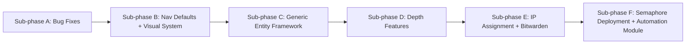
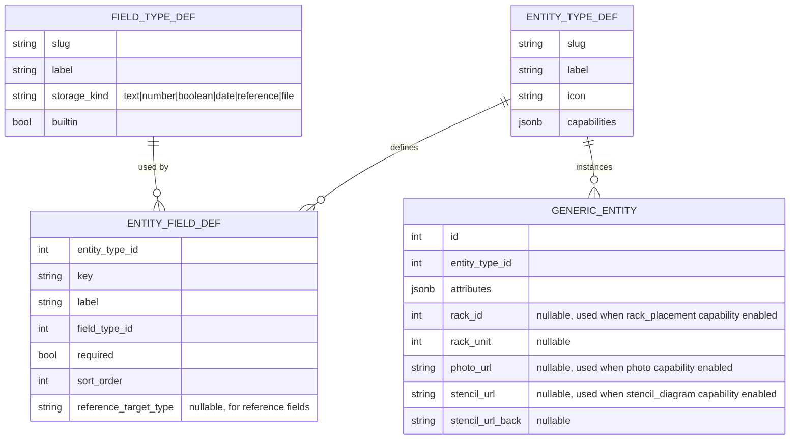
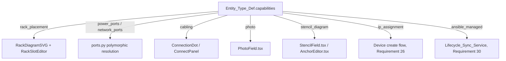
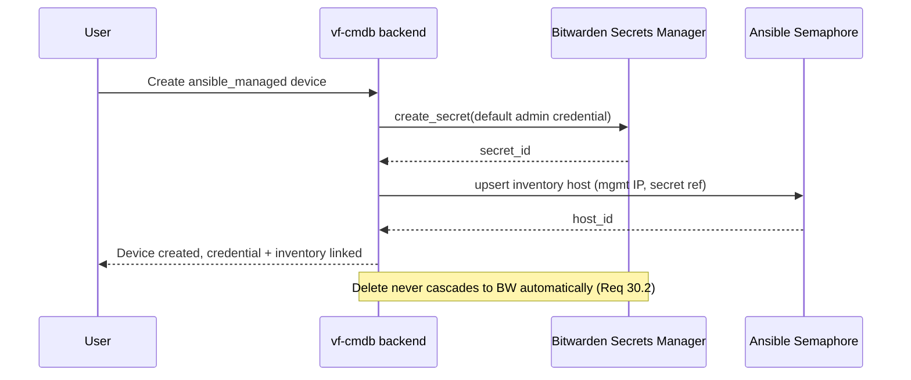

# Design Document

## Architecture

Six sequential sub-phases. A/B are frontend-heavy fixes and polish with no
architectural risk. C is the load-bearing change — a reference-data-driven
generic entity framework — everything in D/E/F either builds on it or reuses
its upload/photo/field patterns.

### Sub-phase A — grid edit integrity

Root cause: `EntityGrid.tsx`'s `onCellValueChanged` success handler calls
`qc.invalidateQueries({queryKey:[resource]})`, which triggers a refetch that
replaces the entire `rowData` array bound to AG-Grid. AG-Grid closes any
open cell editor on that row when its backing row data object is replaced,
even with a stable `getRowId`. Fix: patch only the changed row in the React
Query cache via `qc.setQueryData`, so unrelated rows/cells never see a new
object reference, and only fall back to a full `refresh()` when no cell is
currently being edited (`api.getEditingCells().length === 0`).

### Sub-phase C — generic entity framework

Records are stored generically (`generic_entities.attributes` JSONB) rather
than as dynamically generated SQL tables/columns, so a new type or field
takes effect immediately with no migration. The handful of columns outside
`attributes` (`rack_id`/`rack_unit`, `photo_url`, `stencil_url*`) exist
because those specific integrations (rack elevation, stencil rendering) are
built against real relational columns elsewhere in the app (`rack_units`,
`StencilField`) and reusing those columns is simpler and more consistent
than teaching every consumer to read out of JSONB.

Capability-gated integration points:

`ports.py`'s existing polymorphic `device_table`/`device_id` resolution
(already used to let `rack_units` reference PhysicalServer/NetworkDevice/etc.
without a real FK) gains a `generic_entities` branch: port count/kind for a
Generic_Entity is derived from whichever of its Entity_Field_Defs are the
"port" fields for that capability, not guessed from JSONB shape.

### Sub-phase E/F — credential and automation sync

`bitwarden_client.py` wraps the official `bitwarden-sdk` Python package
(`BitwardenClient`, authenticated via `ORGANIZATION_ID` + a machine account
`ACCESS_TOKEN`, both supplied as env vars — never committed). `semaphore_client.py`
wraps Semaphore's REST API over an API token. Both clients are called from the
same `crud.py` create/update/delete insertion points already used by the
Phase 4 cable-auto-sync hook, guarded by the acting model's Entity_Type_Def
(or hardcoded-type equivalent) having the relevant Capability — so a type
without `ansible_managed` triggers neither client.

## Data Models

### Sub-phase A
- No schema changes beyond a naming-engine dispatch entry for `PatchPanel`/
  `PowerDevice` (uses existing identifier columns).

### Sub-phase C
- `field_type_defs`: `id`, `slug`, `label`, `storage_kind`, `builtin` (bool).
  Seeded with 6 builtin rows.
- `entity_type_defs`: `id`, `slug`, `label`, `icon`, `capabilities` (JSONB
  array of capability strings).
- `entity_field_defs`: `id`, `entity_type_id` (FK), `key`, `label`,
  `field_type_id` (FK), `required` (bool), `sort_order` (int),
  `reference_target_type` (nullable string).
- `generic_entities`: `id`, `entity_type_id` (FK), `attributes` (JSONB, GIN
  indexed), `rack_id`/`rack_unit` (nullable), `photo_url`/`stencil_url`/
  `stencil_url_back` (nullable).
- `field_visibility_overrides`: `id`, `entity_slug`, `field_key`, `visible`
  (bool).

### Sub-phase D
- `rooms`: `id`, `floor_id` (FK), name/naming fields, `blueprint_url`.
- `sections`: `id`, `room_id` (FK, required — a Section always belongs to a
  Room), name/naming fields, `blueprint_url`.
- `racks` gains nullable `room_id`, `section_id` alongside the existing
  `floor_id`; exactly one of `floor_id`/`room_id`/`section_id` is the rack's
  actual parent (enforced at the application layer, consistent with existing
  nullable-hierarchy patterns).
- Every naming-engine-backed table (`sites`, `datacenters`, `floors`, `rooms`,
  `sections`, `racks`, `patch_panels`, `power_devices`) gains a `naming_mode`
  column (`auto`/`manual`, default `auto`).
- `floors` gains `blueprint_url`.

### Sub-phase E
- Devices/Generic_Entities with `ip_assignment` gain a distinguishable second
  IP link (management vs. usage) — implemented as an existing IP-address FK
  plus one new `management_ip_id` FK, following the current single-IP-link
  pattern.
- Credential-bearing rows gain `admin_username`, `bw_secret_id` (Bitwarden
  reference only — no password material stored in vf-cmdb).

### Sub-phase F
- No new vf-cmdb tables; Semaphore owns its own inventory/project data in its
  own (SQLite, single-host dev deployment) store, referenced from vf-cmdb only
  by IDs recorded alongside the device (e.g. `semaphore_host_id`).

## Key Decisions

1. **JSONB-backed generic entities over dynamic DDL.** New user-defined types
   and fields take effect with no deployment; the tradeoff (less rigid typing)
   is acceptable because Postgres JSONB + GIN indexing covers CMDB-scale
   filtering, and every hardcoded type keeps its real columns regardless.
2. **Capability list is a fixed, code-known set** (`rack_placement`,
   `power_ports`, `network_ports`, `ip_assignment`, `ansible_managed`,
   `cabling`, `photo`, `stencil_diagram`, `blueprint`) rather than itself
   user-definable — each capability corresponds to a real integration point
   that has to exist in code; only field *types* and *entity types* are meant
   to be fully open-ended per the user's requirement.
3. **Ansible Semaphore instead of AWX** — AWX 18+ officially requires the AWX
   Operator on Kubernetes; Semaphore is an actively-maintained, single-container,
   Podman-native alternative with equivalent job/inventory/credential concepts,
   avoiding a Kubernetes dependency for a single-host dev deployment.
4. **Bitwarden deletion is never automatic.** The Lifecycle_Sync_Service only
   ever creates/updates/reads secrets, or removes the Semaphore-side inventory
   entry on device delete — a stored credential is only ever deleted by an
   explicit administrator action against Bitwarden itself.
