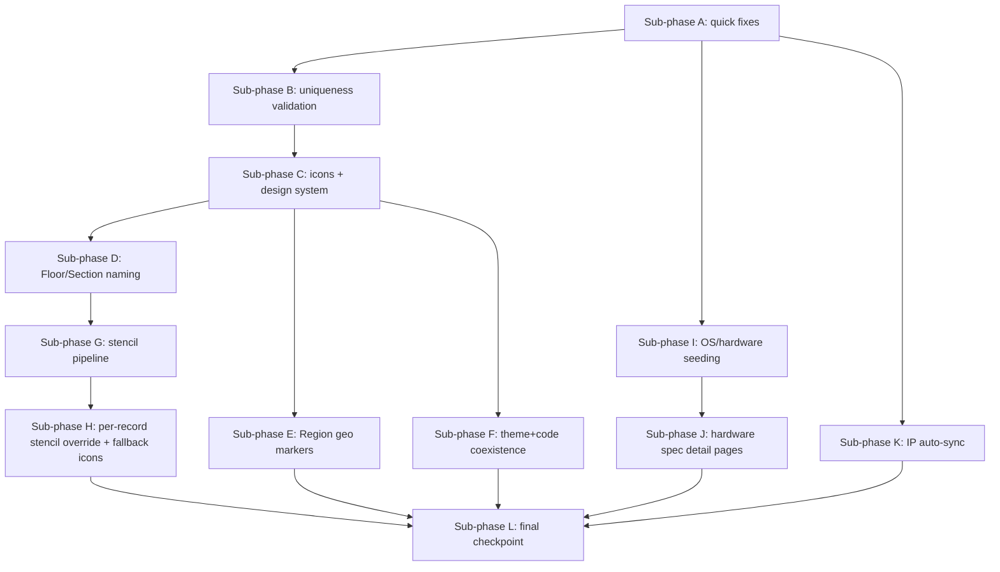

# Design Document: Phase 6 — Data Quality, Visual System & Hardware Intelligence

## Architecture Overview

Twelve sub-phases, each ending in a checkpoint, building on established Phase
4/5 patterns rather than inventing new ones:

- Business-rule validation → new `_validate_*` functions dispatched from
  `crud.py`'s `_validate_model`, same as `_validate_vlan_unique`/`_validate_rack`.
- External API wrappers → the `bitwarden_client.py`/`semaphore_client.py`
  shape (`*NotConfigured` exception, `lru_cache` singleton, injectable client
  param for tests).
- Sync-on-write hooks → the `lifecycle_sync.py` shape, wired into
  `crud.py`'s create/update/delete.
- Per-record file-like fields → the existing `photo_url`/`stencil_url`
  resource-agnostic `ENTITY_REGISTRY` + `hasattr()` resolution pattern.
- Selection-driven detail panels → the `Sites.tsx`/`GenericEntityView.tsx`
  `selected` state + `panel` prop idiom.

## Key Decisions

1. **Uniqueness scope table.** Tables with a natural parent FK get a
   composite (parent_id, lower(name)) uniqueness check; tables without one
   (Organizations, Regions, Clouds, Brands, OsFamily, OsVersion, DeviceRole,
   ClusterType, AppType) get a table-wide `lower(name)` check. This is
   enforced at the application layer (mirroring `_validate_vlan_unique`), not
   a DB-level functional unique index, so the error message can be
   human-readable and suggest a change — consistent with every other
   business-rule validation in this codebase.

2. **Icon column via per-table migration, not a mixin schema change.**
   `LookupMixin` is a Python mixin, not a table; each of the ~14 lookup
   tables lacking `icon` gets the column added in one migration (matching how
   `icon` was added individually to the 4 device-type lookups in Phase 5
   Task 9).

3. **IconPicker reuses `fuzzy.ts`, no new dependency.** The existing
   subsequence-match fuzzy search (already used by `EntityGrid`'s search box
   and `FuzzySelectEditor`) is reused against Lucide's exported icon-name
   list; no new icon library, consistent with the user's choice to keep
   Lucide.

4. **Floor/Section generators mirror Rack/PatchPanel exactly.** Same
   `GENERATORS` dispatch entry shape, same sequential-fallback-when-no-parent-
   number logic, same `roCol`/Code_Mode wiring already built for every other
   naming-engine field — no new mechanism.

5. **Region coordinates are a plain lat/lng pair, not a full geocoding
   integration.** No new geocoding service; an operator clicks the map
   (`react-simple-maps`'s `ComposableMap` exposes its D3 projection via a
   render-prop, letting a click event's pixel coordinates be inverted to
   lat/lng) or types values directly.

6. **Vendor stencil ZIPs are a curated registry, exactly like
   `VISIOCAFE_CATEGORIES`, just populated for real.** No live crawling of
   vendor websites (they aren't stable/crawlable APIs); an admin-maintained
   `VENDOR_STENCIL_SOURCES` dict maps vendor+product-line to a verified ZIP
   URL. Download+extract+cache happens only when a user picks a specific
   entry, writing into the same on-disk cache convention `stencil_library.py`
   already uses.

7. **Stencil override is a new column, not a reuse of the type's own
   `stencil_url`.** Device rows get their own nullable `stencil_url`/
   `stencil_url_back`; resolution order is instance override → device-type
   default → diagram fallback icon. This keeps the existing device-type-level
   stencil meaning unchanged for every record that doesn't set an override.

8. **Diagram fallback icons are static per-category, not user-configurable.**
   A small fixed map (e.g. power→a UPS-appropriate icon, patch-panel→a
   grid/router-ish icon) chosen once in code; `ConnectionDot`'s cx/cy
   computation is untouched since it already never reads pixels off the
   stencil image.

9. **`endoflife.date` sync is pull-based and idempotent**, upserting by
   `(family, cycle)` — safe to re-run via the "Sync now" action without
   duplicating rows, mirroring the guarded-migration idempotency convention
   used everywhere else in this codebase.

10. **Hardware spec lookup never silently writes.** Both the Icecat path and
    the Brave Search fallback return a *proposed* payload; the frontend always
    shows a confirm-before-save step — matching the explicit design principle
    from Phase 5 that automated/external data is never trusted blindly (same
    posture as Bitwarden-generated credentials being shown, not silently
    applied).

11. **Gather-Facts is a separate mechanism from Icecat/Brave**, since a
    power device has no OS to gather facts from. It only applies to
    `ansible_managed` records with real SSH reachability (servers,
    workstations, network devices), using the existing Semaphore
    template/task infrastructure from Phase 5 Sub-phase F — no new
    automation transport.

12. **IP auto-sync is a new `lifecycle_sync.py`-style hook**, not a
    re-purposing of `GenericEntity.ip_id`/`management_ip_id` (those already
    are `ip_assignments` FKs and need no sync). It only concerns the
    hardcoded device tables' plain `INET` columns, which today are completely
    decoupled from `ip_assignments`.

## Data Model Changes

- `icon` added to: organizations, clouds, regions, campuses, buildings,
  floor-sections, network-subtypes, network-id-types, cluster-types,
  app-types, os-families, os-versions, device-roles, brands.
- `notes` renamed to `description` on every `LookupMixin` table, `SiteAddress`,
  `FieldTypeDef`.
- `latitude`/`longitude` (nullable numeric) added to Region.
- `stencil_url`/`stencil_url_back` (nullable) added to NetworkDevice,
  PhysicalServer, VirtualMachine, Workstation, PowerDevice, PatchPanel,
  ContainerApp.
- Category-specific structured spec columns added to NetworkDeviceType,
  ComputeDeviceType, StorageDeviceType, PowerDeviceType (exact fields defined
  in Task 33).
- No new tables except the in-code `VENDOR_STENCIL_SOURCES` registry (a
  Python module, not a DB table — matching `VISIOCAFE_CATEGORIES`).

## Testing Strategy

Same as every prior phase: pytest against a real Postgres test DB
(`vfcmdb_test`, never `vfcmdb`) for every backend change, Vitest+tsc+build for
every frontend change, and live curl/UI verification against the running dev
stack at each checkpoint. External API clients (endoflife.date, Icecat, Brave
Search) are tested against mocked HTTP transports only — no test ever makes a
real external network call.
